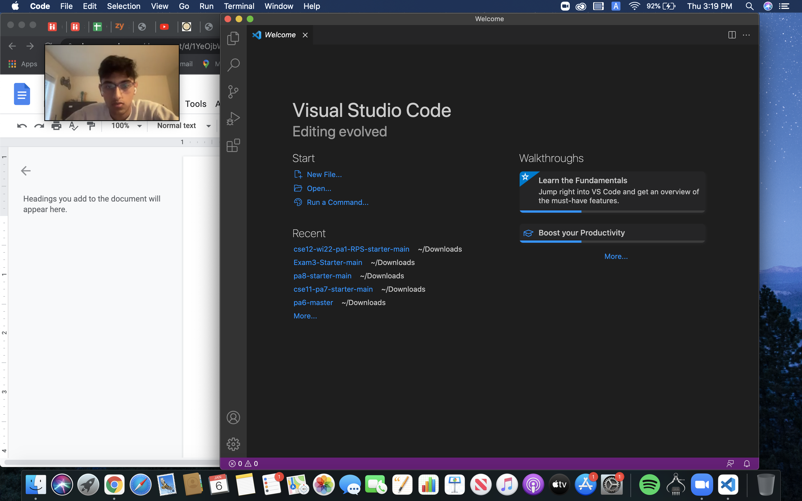
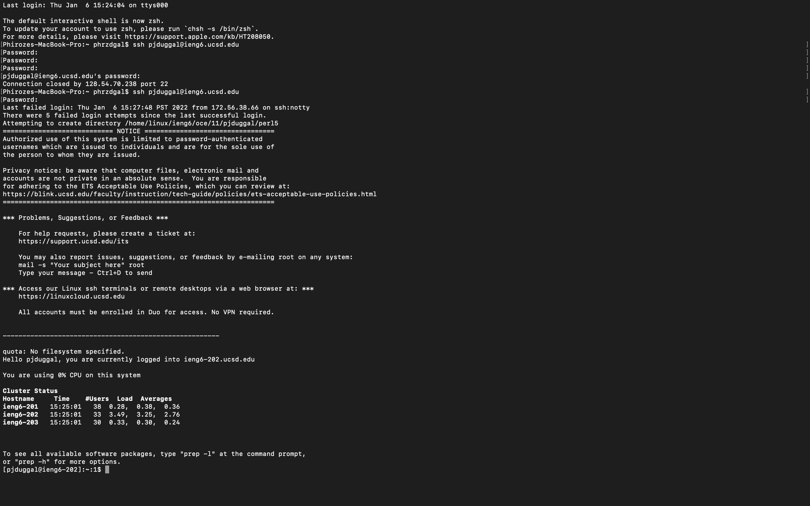
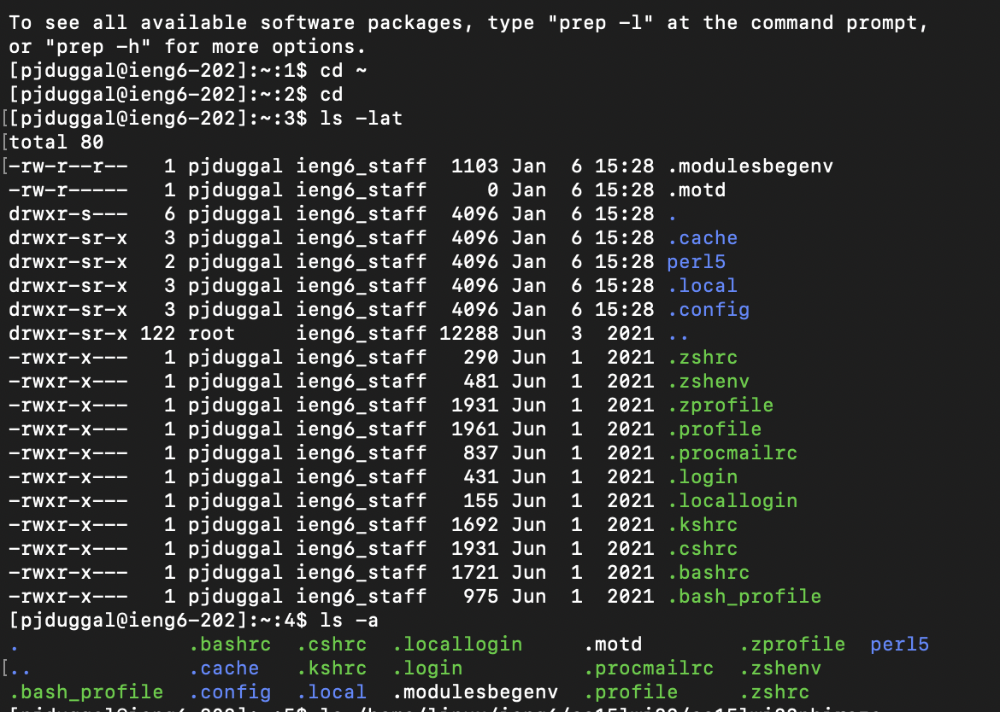
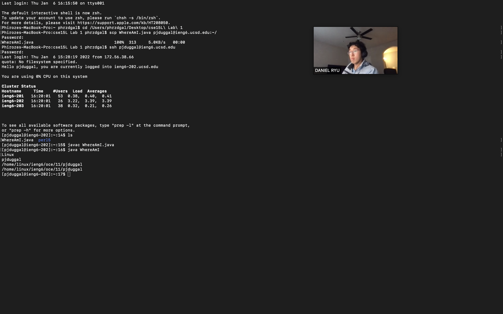
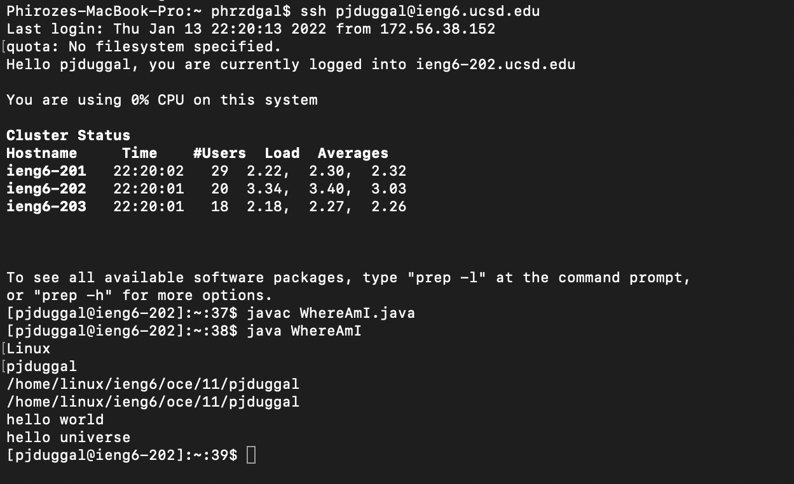
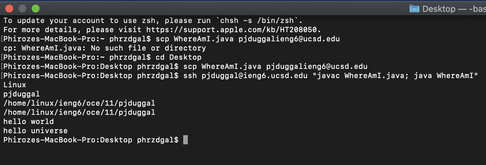

#           How to Work on a Remote Server from Home

Hello! In this blog you will learn to enter and access a remote server/computer from your home computer (the client), copy files stored from the client 
on to the server, and run your files on that server. 

----
# Step 1: Download Visual Studio Code 
---------

1. Go to Visual Studio Code website. The link to it is provided below: 

    [VS Code Link] (https://code.visualstudio.com/)

2. Follow the directions on the site to start the download the program.
3. Agree to the terms and conditions and try to run it on your computer to make sure everything works fine!

---

# Step 2: Remotely Connecting
-----------
 

1. Look up your account linked with UCSD:
[Account Lookup Link]((lab-report-1-week-2.html))
2. Open your terminal on VS Code through View, terminal, and enter this command while also replacing "zz" with your course specific account: 
* ssh cs15lwi22zz@ieng6.ucsd.edu
3. Since it will be your first time connecting, you will get a message like: 

"The authenticity of host 'ieng6.ucsd.edu (128.54.70.227)' can't be established.
RSA key fingerprint is SHA256:ksruYwhnYH+sySHnHAtLUHngrPEyZTDl/1x99wUQcec.
Are you sure you want to continue connecting (yes/no/[fingerprint])?" 

Type yes, enter, and give your password when prompted. Your screen should look like my black screen image above if you've done everything correctly. You will then be connected to the remote server. 

----
# Step 3: Trying Some Commands
----------
 

1. Through the terminal, enter some commands both on the client and the remote server including: 

* cd
* ls -lat
* pwd

2. Running "ls - lat" on the terminal will provide something similar to the image above where I had run the command through the remote server. A list of directories on that remote server is shown. 

-----

# Step 4: Moving Files with scp
----------

1. scp is the command line used to transfer files from the client onto a remote server. 
2. To transfer a file from the client onto the remote server, make sure you are currently working on your home computer and enter into the terminal the information provided below while also replacing "zz" with your username as usual: 

* scp WhereAmI.java cs15lwi22zz@ieng6.ucsd.edu:~/

3. Enter your password once prompted, and the file should be moved on the remote server. You should be logged out of the remote server by now, so you can use the ssh command to log back in and enter "ls ~" into the terminal to verify a given directory has been transferred over to the remote server as below: 

* ssh cs15lwi22@ieng6.ucsd.edu "ls"

Once again, make sure you are using your username and not the exact one provided above. 

------

# Step 5: Setting an SSH Key
---------

1. If you find having to constantly log in when accessing the remote server tedious, than should be happy to know that there is solution: setting up SSH keys. Keys are stored in both the client and the remote computer and are paired when the ssh command to access the remote server is ran on your home computer. 
2. First, enter onto your terminal: 
[Image](S.png)

3. Now, copy the public key that was created to the .ssh directory of your account onto the remote server:

[Image](SS.png)

You should now be able to ssh or scp on your computer without a password as I have done in the provided image for the step. 

----
# Step 6: Optimizing Remote Running
-------

1. There are methods to easing the ammount of work one may have to do to copy and run files on a remote server. You may use in the terminal to log onto the server and run a command simultaneously: 

* ssh cs15lwi22@ieng6.ucsd.edu "insert a command here"

You may use semicolons to run multiple commands at once such as in: 

* cp WhereAmI.java OtherMain.java; javac OtherMain.java;

2. As of now, the best method of making an edit to a local file and running it on the server in the shortest amount of keys possible that I could find is:
Go to home directory using 

* ssh cs15lwi22@ieng6.ucsd.edu "ls"

* Use Javac and java to run the file on the server. 

I personally use the up key on the terminal to call the ssh, Javac, and Java commands so that I do not have to type excessively and so that I really only have to think about the up key and the enter key. 

