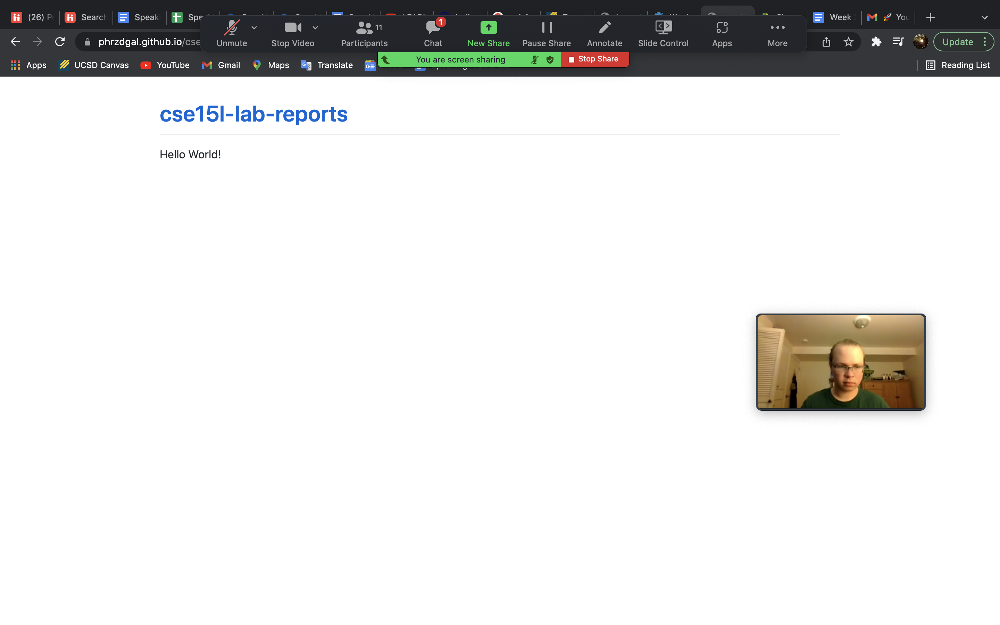

Hello! In this blog you will learn to enter and access a remote server/computer from your home computer (the client), copy files stored from the client 
on to the server, and run your files on that server. 

Step 1: Download Visual Studio Code 

 
