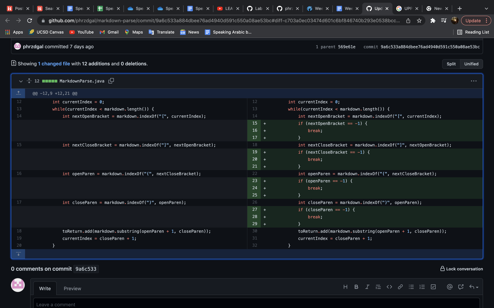
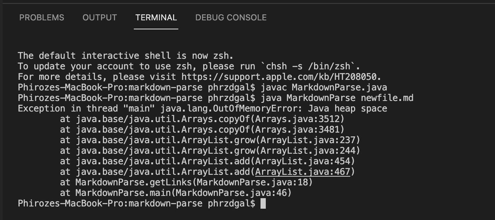
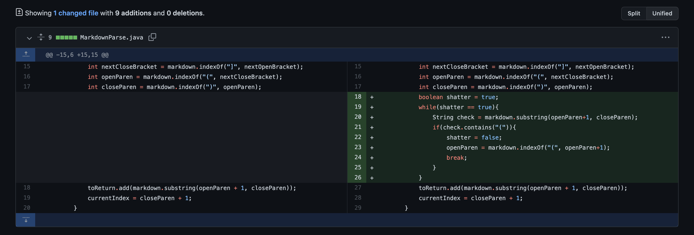
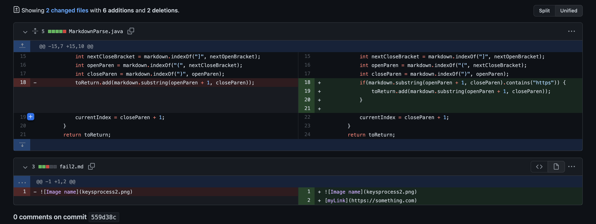

# Lab Report 2 Week 4
---
In labs 3 and 4, our group made 3 code changes in order to fix the bugs that we produced. They are displayed and elaborated upon below. 

# Code Change 1

For the first code change, the link to the test file for a failure-inducing input that prompted the change is given: 

[Code Change 1 Link] (https://github.com/phrzdgal/markdown-parse/blob/9a6c533a884dbee76ad4940d591c550a08ae53bc/newfile.md)

The failure-inducing input produced this symptom / error message (the output of running the file at the command line for the failing version):

The bug above was that the while loop would run infinitely because the code was set to search for certain characters in the input file that did not exist and was thus stuck doing so without ever reaching and outputting the file links. The corresponding symptom was the error message shown in the terminal output (image directly above) where an OutOfMemoryError was produced in the form of an exception. The exception is thrown because of the faulty code producing a while loop that did not break when necessary and instead kept looping. The failure inducing input was the testfile "newfile.md" which revealed the bug through the symptom because it contained multiple occurrences of the opening characters (such as "[") without also containing just as many of the corresponding closing characters (such as "]"), so there were searches for characters that did not exist. 

# Code Change 2

For the second code change, the link to the test file for the failure inducing input that prompted the change is given: 

[Code Change 2 Link] (https://github.com/fantasticfishman/markdown-parse/blob/68a6720312dd061140b540ac996aec6a4dd9d46f/fail.md)

The failure-inducing input produced this symptom / error message (the output of running the file at the command line for the failing version):

# Code Change 3

For the third code change, the link to the test file for the failure inducing input that prompted the change is given: 

[Code Change 3 Link] (https://github.com/fighterkabir/markdown-parse/commit/0e05f82551ef8c36d66acbe3d82309b472dfdd9d#diff-e5e6f9ec0a19cc77d901279b30fdeb20ae719aba32347ae8e7df67ca181a333b)

The failure-inducing input produced this symptom / error message (the output of running the file at the command line for the failing version): 

