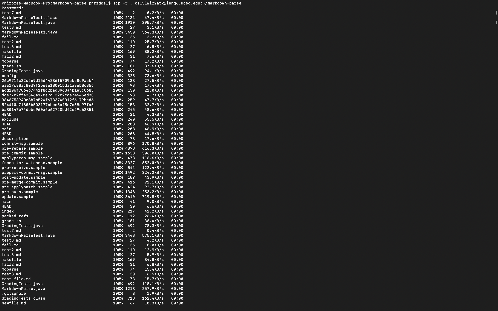
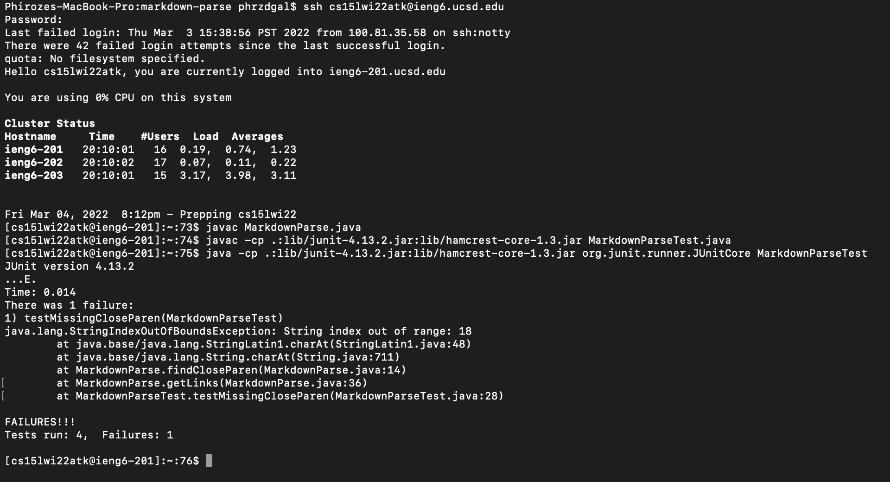
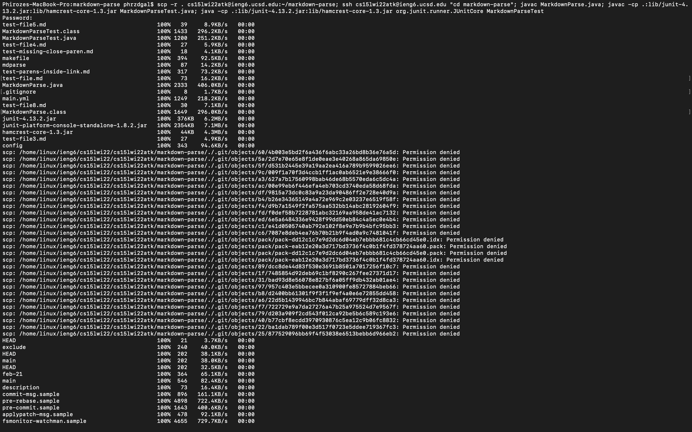
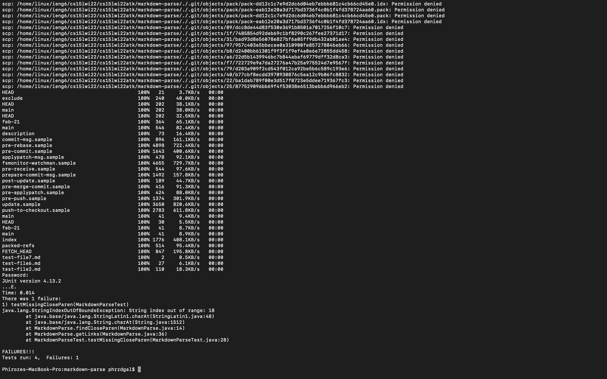

# Group Choice Option 3: Copying Whole Directories to the Remote Server Using scp -r
Whole markdown-parse Directory Copied to ieng6 Account (Screenshot Below)
-----
 
In order to copy the markdown-parse directory to the ieng5 account, one must first be working in the markdown-parse directory - to confirm this, one could use the pwd command int he terminal to determine which directory they are working from. Then, using the scp -r command 
(entering scp -r . cs15lwi22atk@ieng6.ucsd.edu:~/markdown-parse in the terminal) the contents within the markdown-parse directory may be recursively copied to the remote server. The command given in the terminal and the first contents to be copied over are given in the above image. 

Logging Into ieng6 Account and Compiling and Running Tests for Repository There (Screenshot Below)
---

Since we are not working in the remote server once the repository is copied over there, we can enter using the command ssh cs15lwi22@ieng6.ucsd.edu and start working from the remote server. We then can cd into the markdown-parse repository and compile and run the our tests there using the javac MarkdownParse.java and the last two commands involving the compilation and running of the JUNIT tests (shown in the above image).

Combining scp, ;, and ssh to Copy the Whole Directory and Run the Tests in One Line 
---

We may also combine the scp, ssh, and compile commands in one line using the ; symbol to transfer the repository to the remote server and run specific commands there. To combine the scp and ssh commands, oen simply can insert ; between the commands one would otherwise write separately. And to run commands from the remote server directly on that single line, one can cd into markdown-parse using cd in quotes (shown above in the image), and then continue to use the ; key to add the statements to compile and run both the MarkdownParse file and the JUNIT tests. 
