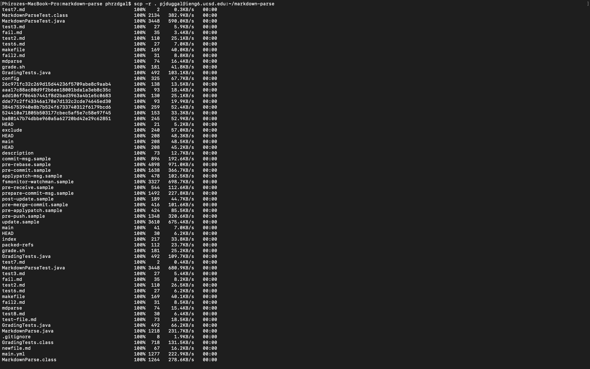
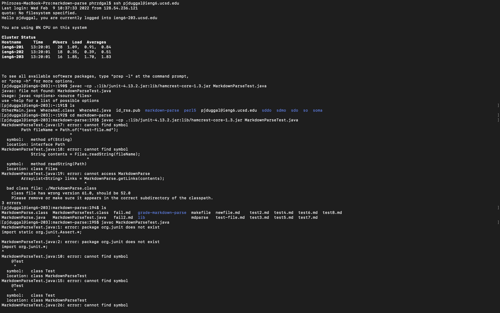
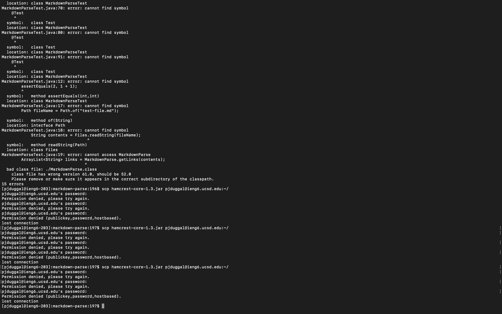

# Group Choice Option 3: Copying Whole Directories to the Remote Server Using scp -r
Whole markdown-parse Directory Copied to ieng6 Account (Screenshot Below)
-----

In order to copy the markdown-parse directory to the ieng5 account, one must first be working in the markdown-parse directory - to confirm this, one could use the pwd command int he terminal to determine which directory they are working from. Then, using the scp -r command 
(entering scp -r . cs15lwi22@ieng6.ucsd.edu:~/markdown-parse in the terminal) the contents within the markdonw-parse directory may be recursively copied to the remote server. 

Logging Into ieng6 Account and Compiling and Running Tests for Repository There (Screenshots Below)
---

Since we are no longer working in the remote server, we can enter ssh cs15lwi22@ieng6.ucsd.edu to start working from the remote server. We can cd into the markdown-parse repository and compile and run the our tests there. 

Note: 
The screenshots below show that running the tests there failed. Perhaps this was due to not having transferred the proper hamcrest and junit files to the remote server. When transferring these files over, the password to the ieng6 account was needed. This was not known. Therefore, the tests could not be proceeded correctly, and the proper one line command to copy the directory and the run the tests could not be shown. 
