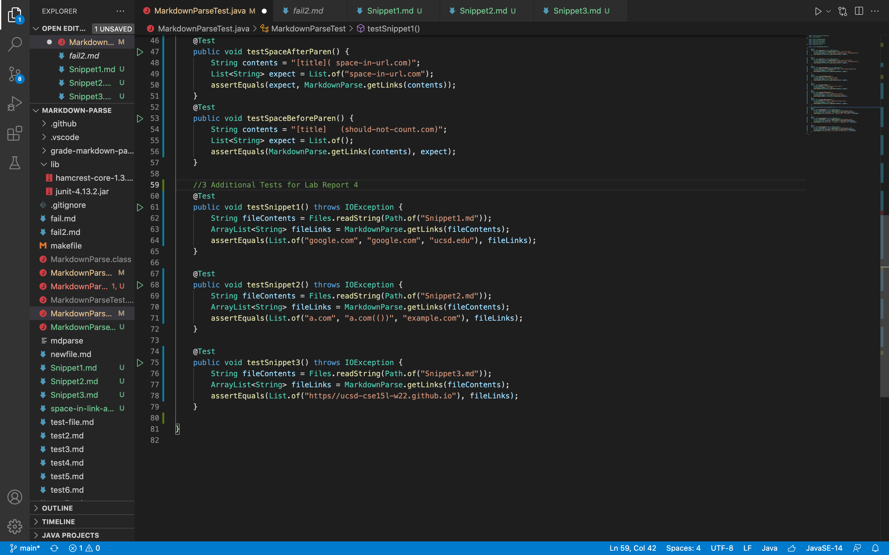
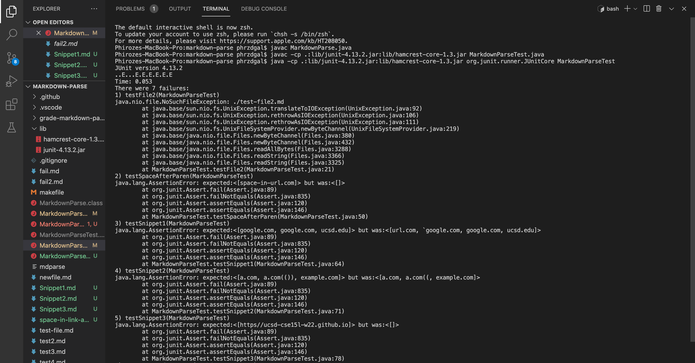
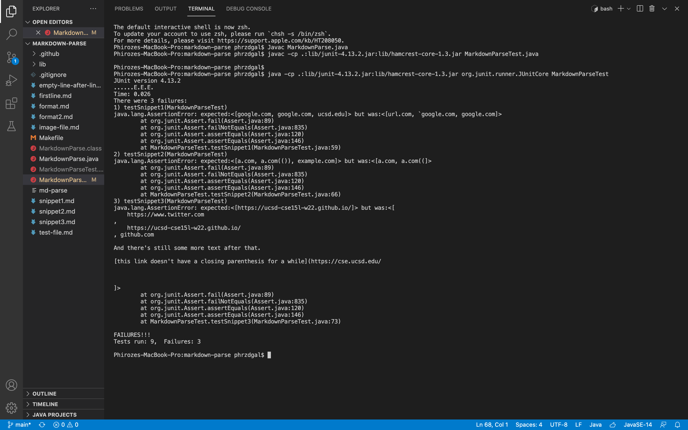

# Lab Report 4 Week 8: Using Link Snippets to Test 2 Versions of MarkdownParse.java

Deciding the Excpected Outputs by the MarkdownParse.java files and Turning Them Into Tests
---
 
In order to determine the correct expected outputs by the MarkdownParse.java files given Snippet 1, Snippet 2, and Snippet 3, one could use the VSCode preview or CommonMark demo site to produce an output from their internal version of MarkdownParse. The expected outputs are compared to the actual outputs in the tests above, and the three tests above are the same for the personal MarkdownParse.java file and the MarkdownParse.java file that the lab group reviewed in week 7. File links are read into a list of strings with the help of the file commands (show in image above). 

Output of Running Above Tests on Personal MarkdownParse.java File
---
 
In the image above, the last three test failiures indicated in the output (corresponding to testSnippet1(), testSnippet2(), and testSnippet3()) are the failiures for the three tests with the provided snippets respectively. This output shows the failiures corresponding with the personal MarkdownParse.java file.

Output of Running Above Tests on the MarkdownParse.java File that the Group Reviewed in Week 7
---
 
In the image above, the three test failiures indicated in the output (corresponding to testSnippet1(), testSnippet2(), and testSnippet3()) are the failiures for the three tests with the provided snippets respectively. This output shows the failiures corresponding with the MarkdownParse.java file that the lab group reviewed in week 7. 

Question Responses 
---
1. It does seem possible that a minor change in the program would be responsible for making the code produce the proper output for snippet 1 and all related cases that use inline code with backticks. A description of this change could be that an if statement ought to be added after the string variable link gets the markdown substring from openParen to closeParen which checks whether or not the backtick character is included. If so, one could add a section of code which parses through each character in the substring to find the indices of any backtick, and if one or more are found, the code ought to remove the character at those indices using the deleteCharAt() method.

2. It does seem possible that a minor change in the program would be responsible for making the code produce the proper output for snippet 2 and all related cases that nest parentheses, brackets, and escaped brackets. For this adjustment, the failure output shows that the first link and only a part of the second link were outputted as links - thus, to fix the issue, it would be reasonable to write a section of code which checks whether another closed paranthesis character exists after the closed paranthesis of the current index, and if so, closeParen ought to get that index. This process may be done for all of the variables mentioned above holding an index value to ensure that the section of code/link does not cut off prematurely. 

3. It does seem possible that a minor change in the program would be responsible for making the code produce the proper output for snippet 3 and all related cases that have newlines in brackets and parantheses. The output shows that the MarkdownParse.java file does not function properly when dealing with the \n character as it provides the entire white space in the link that ought to have been outputted instead of ignoring the extra spaces and only dealing with the link. One could make a useful change by, for example, constructing an if statement which checks whether or not \n was used within parantheses or brackets and updating the indices for the specific variable holding the index of interest accordingly. 