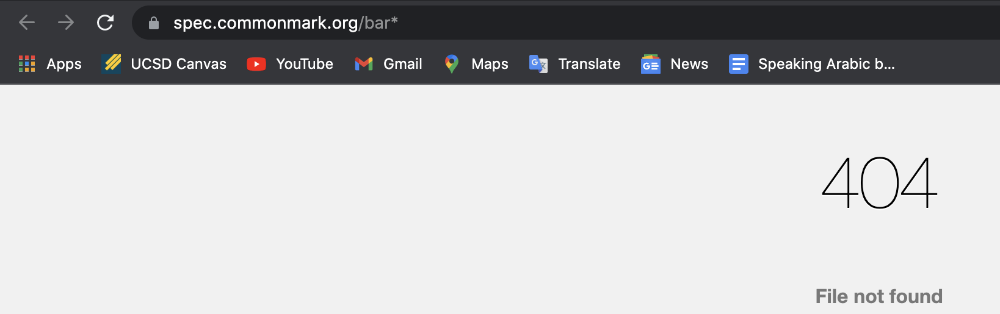

# Lab Report 5 Week 10: Finding Tests Producing Differenct Outputs Using the Same Test for Two Different Implementations of Markdown Parse and Offering Potential Fixes/Solutions

Finding Tests with Different Results 
---
The tests producing different results between the class shared markdown-parse implementation (the repository is named "markdown-parse" on the ieng6 remote server) and the represenative markdown-parse implementation from our lab group (the repository is named "mparse" on the ieng6 remote server and is cloned from lab group member Ken's repository) were tests 22.md and 32.md under test-files. The tests that produced different results were found through use of the diff command in the terminal on the results of running a bash for loop. The bash for loop combined with the makefile allow for the names of the tests to be printed alongside the results for that test and every other test in test-files/ directory. This was done for both the class shared and group representative repositories, and the outputs of both were copied into separate results.txt files. The diff command in the terminal allowed for the text within these files to be compared by line, and differences in text were outputted right back onto the terminal for the user to see. The output (shown in the next image below) indicated that on lines 270 and 492 for both text files, there were differences in the test results. Theses lines correspond tests 22.md and 32.md respectively.

Test Results, Correct Ouputs, and Insights to Code Fixes 
---
 
Above is the output of running the diff command in order to compare both text files.

 
Above is a closer image of the results for the first two differences. The top result indicates that on line 270 for both text files (corresponding to test 22.md when the line is searched for in the text files), the top output corresponding to the the mparse repository for the group representative implementation outputting a string of characters and the bottom output below the dashed line corresponding to markdown-parse repository for the class shared implementation outputting an empty list are different. A similar thing may be said about the second test (32.md) where it is found by searching for the test found in line 492 of either text file containing the output. The list to the right of the "<" indicates the output for the group representative implementation, and the list to the right of ">" indicates the empty output for the class shared implementation. 

Test 1 
---
With the actual outputs shown in the second image in the brackets for the line 270- [/bar\* "ti\*tle"] for the group representative implementation and the empty list [] for the shared class implementation, neither the group representative implementation nor the shared class implementation produced the correct output. This is confirmed both by Commonmark Preview Demo as shown in the screenshots below of what it reads as the link. We will take the Commonmark Preview Demo output at face value as the correct link - this is whatever is included as part of the link in Commonmark URL.

Therefore, the correct output should be the following within the brackets: [bar*]. 

Looking at the shared class implementation, the bug that seems to be producing the error is fact that the big objective of the code is to output whatever string is inside the open and closed parantheses that occur after an open and closed pair of brackets. This is a larger issue that occurs for the entire getLinks method. A screenshot of the code is provided below: 

The code within the method may be fixed by adding additional requirements in order for the string to be allowed within toReturn, such as not allowing strings within quotes or that are not formatted in a way a link ought to be. 

Test 2
---
With the actual outputs shown in the second image in the brackets for the line 492 - `[/f&ouml;&ouml; "f&ouml;&ouml;"]` for the group representative implementation and the empty list [] for the shared class implementation, neither the group representative implementation nor the shared class implementation produced the correct output. This is confirmed both by Commonmark Preview Demo as shown in the screenshots below of what it reads as the link. We will take the Commonmark Preview Demo output at face value as the correct link - this is whatever is included as part of the link in Commonmark URL.

Therefore, the correct output should be the following within the brackets: [föö].

Again, looking at the shared class implementation, the bug that seems to be producing the error is fact that the big objective of the code is to output whatever string is inside the open and closed parantheses that occur after an open and closed pair of brackets instead of actively searching for specific characters which ought to be excluded from the outputted link including parantheses and characters within or slashes. However, the additional bug that occurs for this test as opposed to the previous test as well is that the code does not register certain combinations of characters which ought to be outputted as special characters (such as is the case with the "o" with the two dots above which corresponds to the character combination "`&ouml;`"). Because such combinations are not checked for, this is a larger issues that occur for the entire getLinks method. A screenshot of the code is provided below: 

The code within the method may be fixed by adding additional requirements in order for the string to be allowed within toReturn, such as not allowing strings within quotes or that are not formatted in a way a link ought to be. Furthermore, to fix the one bug that does not necessarily apply for the test above, if statements may be added for the string element in the list after each iteration of the while loop to check if certain common combinations of letters exist which may then be converted within the string as that special character. 
